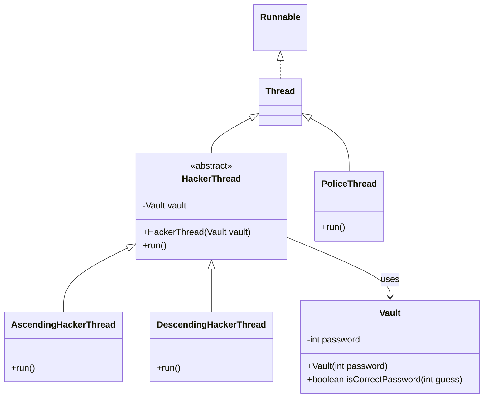

## Funny Idea

- Vault keeps a passowrd, example: 7523
- AscendingHackerThread tries to guess the password from 0 to 9999
- DescendingHackerThread tries to guess the password from 9999 to 0
- Both hackers are trying to guess the password at the same time
- Police Thread is trying to catch the hackers, it counts down from 10 to 0, if it reaches 0 before the hackers guess the password, they lose

