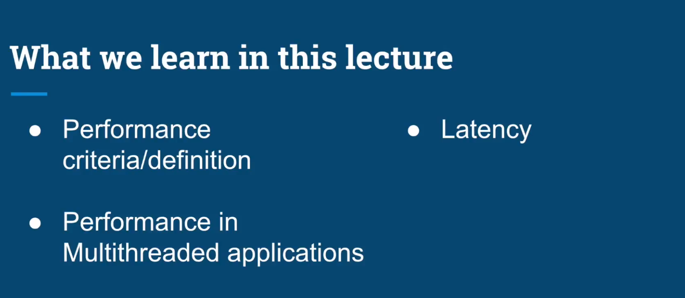
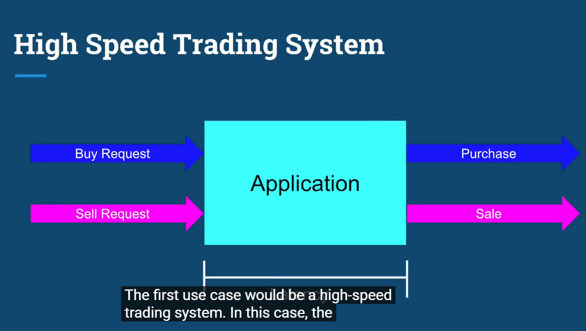
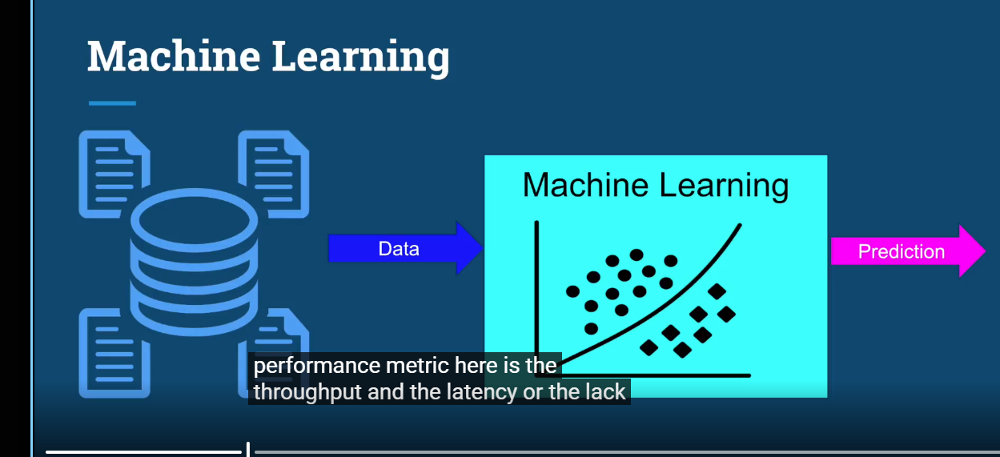
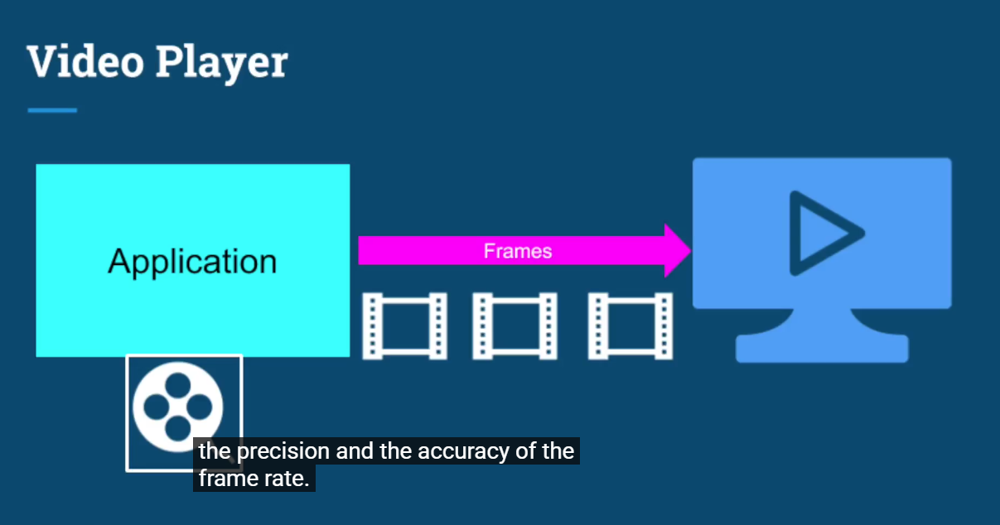
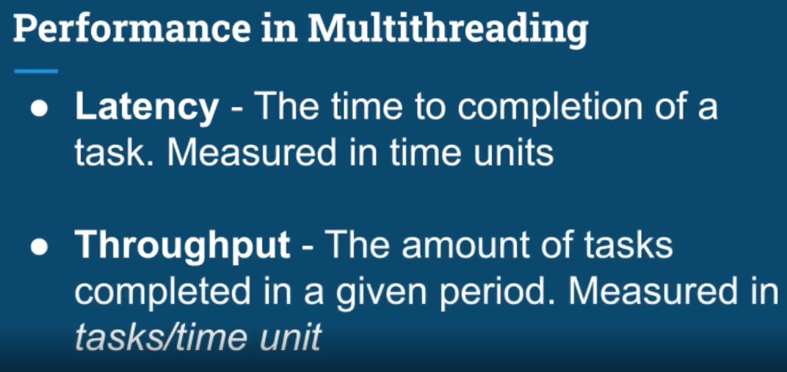
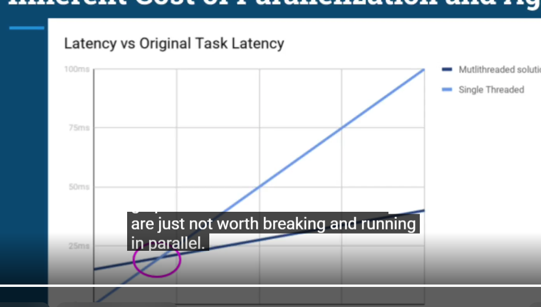
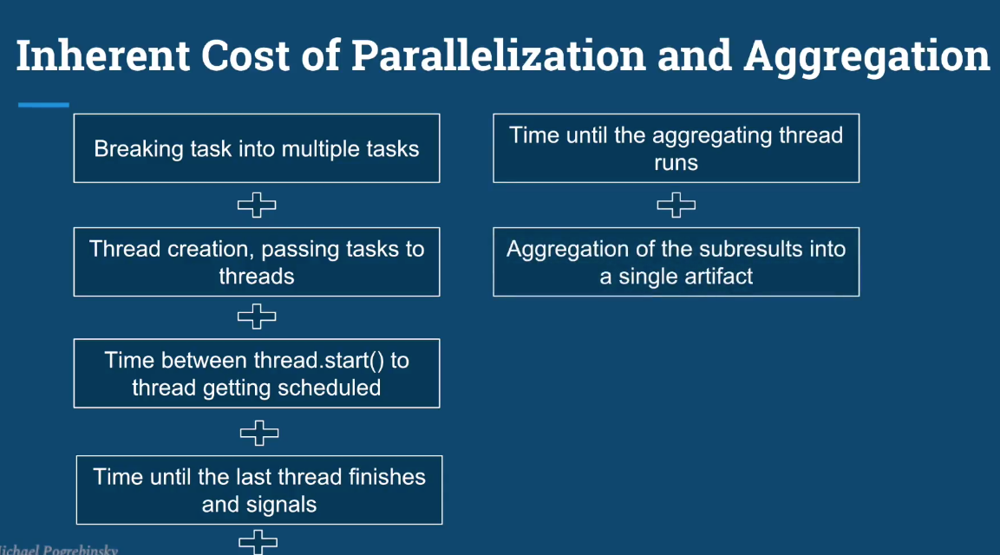
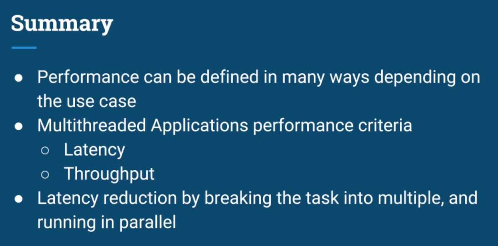

# Performance in Multithreaded Applications

## 1. Lecture Overview

This lecture focuses on three main ideas:

- Performance criteria / definition
- Performance in multithreaded applications
- Latency

The key point is that **performance does not always mean the same thing**. Different applications care about different performance metrics.

---

## 2. Performance Depends on the Application

Before optimizing a system, we need to ask:

> **What does "good performance" mean for this application?**

Different systems may prioritize:

- Low latency
- High throughput
- Stable frame rate
- Accuracy / precision
- Ability to process a large amount of data

Therefore, performance should be measured using metrics that match the application's goal.

---

## 3. Example: High-Speed Trading System

Flow:

```text
Buy Request  ──┐
               ├──> Application ──> Purchase
Sell Request ──┘                 └──> Sale
```

For a high-speed trading system, the important metric is usually **latency**.

A request should be processed as quickly as possible because even a very small delay can matter.

```text
Request arrives
      |
      v
[ Application ]
      |
      v
Result returned

<---- Latency ---->
```

### Goal

```text
Minimize latency
```

Example:

```text
Request A -> 2 ms
Request B -> 5 ms
```

The 2 ms request has lower latency and therefore completes faster.

---

## 4. Example: Machine Learning System

Typical flow:

```text
Large amount of data
        |
        v
[ Machine Learning Model ]
        |
        v
    Prediction
```

For a machine learning/data-processing system, we may care about:

- **Throughput**: how much data/tasks can be processed over time
- **Latency**: how long one prediction/task takes
- Prediction quality/accuracy, depending on the system

If millions of records need to be processed, maximizing throughput can be more important than minimizing the latency of one individual item.

---

## 5. Example: Video Player

Typical flow:

```text
Application -> Frames -> Screen
```

For a video player, performance is not only about finishing one task quickly.

Important criteria include:

- Stable frame rate
- Smooth playback
- Producing frames before their display deadline

For example:

```text
30 FPS -> ~33.3 ms available per frame
60 FPS -> ~16.7 ms available per frame
```

If frame computation takes longer than the available time, frames may be delayed or dropped, causing stuttering.

---

# 6. Performance in Multithreading

Two fundamental performance metrics are:

## Latency

> **Latency = the time required to complete one task.**

Measured in units of time, for example:

- nanoseconds
- milliseconds
- seconds

Example:

```text
Task starts: 10:00:00.000
Task ends:   10:00:00.200

Latency = 200 ms
```

Smaller latency is usually better.

```text
Lower latency = faster response
```

---

## Throughput

> **Throughput = the number of tasks completed during a given period of time.**

Typical units:

```text
tasks / second
requests / second
files / minute
transactions / second
```

Example:

```text
1000 requests completed in 10 seconds

Throughput = 1000 / 10
           = 100 requests/second
```

Higher throughput is usually better.

```text
Higher throughput = more work completed per unit of time
```

---

# 7. Latency vs Throughput

These concepts are related but **not identical**.

| Metric | Main question | Unit | Usually desirable |
|---|---|---|---|
| Latency | How long does one task take? | ms, s | Lower |
| Throughput | How many tasks finish per unit time? | tasks/s | Higher |

Example:

```text
System A:
1 request = 100 ms
10 requests/second

System B:
1 request = 200 ms
100 requests/second
```

System A has better latency, while System B has better throughput.

So a system can have **higher throughput without having lower latency**.

---

# 8. Why Multithreading Can Improve Performance

Suppose there are four independent tasks:

```text
Single thread:

Task 1 -> Task 2 -> Task 3 -> Task 4
```

If each task takes one second:

```text
Total time ≈ 4 seconds
```

With multiple threads:

```text
Thread 1 -> Task 1
Thread 2 -> Task 2
Thread 3 -> Task 3
Thread 4 -> Task 4
```

When the hardware and workload allow them to run in parallel, total elapsed time may approach one second.

This can increase **throughput** and sometimes reduce overall completion time.

However:

> More threads do not automatically mean better performance.

Too many threads may introduce:

- Context switching
- Synchronization overhead
- Lock contention
- Memory overhead
- CPU competition

---

# 9. Connection to Java Multithreading

When optimizing Java multithreaded code, first identify the real target.

### If the goal is low latency

Focus on reducing the time required for one task/request.

```text
start
  |
  v
process task
  |
  v
finish

Latency = finish - start
```

### If the goal is high throughput

Focus on completing as many tasks as possible over a period of time.

```text
Throughput = completedTasks / elapsedTime
```

This distinction becomes important when deciding:

- How many threads to create
- Whether tasks should run concurrently
- Whether to use a thread pool
- How much synchronization is acceptable
- Whether the workload is CPU-bound or I/O-bound

---

# 10. Quick Memory Notes

```text
Performance
   |
   +-- Latency
   |      -> Time for ONE task
   |      -> Lower is better
   |
   +-- Throughput
          -> Number of tasks per time unit
          -> Higher is better
```

Examples:

```text
Trading system -> Latency is critical
Machine learning / batch processing -> Throughput is often critical
Video player -> Frame rate / frame deadline is critical
```

## One-line summary

> **Latency tells us how fast one task finishes; throughput tells us how much work the system can finish over time. Multithreading is useful when it improves the performance metric that actually matters for the application.**

---

# 9. Reducing Latency with Parallelism

Suppose one task takes total time `T`.

```text
Single task:

[                 Task                 ]
<------------------ T ----------------->

Latency = T
```

If the work can be divided into `N` independent subtasks and all of them run at the same time:

```text
Thread 1 -> Task 1
Thread 2 -> Task 2
...
Thread N -> Task N
```

In the **ideal theoretical case**:

```text
Latency ≈ T / N
```

So splitting a task across `N` workers could theoretically improve performance by a factor of `N`.

However, this is only an ideal model. Real programs have scheduling, thread-management, synchronization, and aggregation overhead.

---

# 10. Can Every Task Be Split into Subtasks?

**No. Not every task can be divided into subtasks that run in parallel.**

A better way to write the idea is:

```text
- Break down a task into smaller subtasks when possible.
- Independent subtasks can run in parallel.
- Dependent subtasks must run sequentially or wait for previous results.
```

The important distinction is:

```text
Breaking a task into subtasks != automatically running them in parallel
```

Example of parallelizable work:

```text
Process 100 independent CV files

CV 1 -> Thread 1
CV 2 -> Thread 2
CV 3 -> Thread 3
...
```

Each CV can be processed independently, so the work is suitable for parallel execution.

Example of dependent work:

```text
Step 1: Read file
   ↓
Step 2: Parse content
   ↓
Step 3: Use parsed result to calculate score
```

`Step 3` depends on the result of `Step 2`, so those steps cannot simply run at the same time.

---

# 11. How Many Threads Should We Use? (`N = ?`)

For a CPU-bound workload on a general-purpose computer, a useful starting point is:

```text
Number of active threads ≈ Number of available CPU cores
```

Example:

```text
Core 1 -> Task 1
Core 2 -> Task 2
Core 3 -> Task 3
Core 4 -> Task 4
```

If there are 4 cores and 4 CPU-intensive tasks, the operating system can potentially execute one task on each core.

But if we create more CPU-bound runnable threads than available cores:

```text
4 cores
8 runnable CPU-bound threads
```

then the CPU must repeatedly switch between threads.

This may introduce:

- context-switching overhead
- cache misses
- scheduling overhead
- increased latency

Therefore:

```text
More threads != always better performance
```

---

# 12. Important Exception: Blocking / I/O Tasks

The rule:

```text
# threads ≈ # cores
```

is mainly useful when threads are **CPU-bound and continuously runnable**.

For example, when threads perform heavy calculations without:

- file I/O
- network I/O
- database waiting
- blocking calls
- `sleep()`

If a thread frequently waits for I/O, the CPU core may become available to execute another thread.

Therefore, an I/O-heavy application can often benefit from having **more threads than CPU cores**.

Example:

```text
Thread 1 -> waiting for database
Thread 2 -> waiting for network
Thread 3 -> CPU work
Thread 4 -> CPU work
```

The optimal thread count depends on the workload, not only on the number of CPU cores.

Also, the simple model assumes that no other processes are heavily consuming the CPU.

---

# 13. Physical Cores vs Virtual Cores (Hyper-Threading)

Modern CPUs may expose more **logical / virtual cores** than physical cores.

Example:

```text
1 Physical Core
      |
      +---- Logical Core 1
      |
      +---- Logical Core 2
```

With technologies such as Hyper-Threading / SMT, some hardware resources inside a physical core are duplicated, while other resources are shared.

Therefore:

```text
2 logical cores != 2 completely independent physical cores
```

Using two logical cores can improve utilization, especially when one thread is temporarily unable to use part of the CPU pipeline, but it normally does **not** provide the same performance as having two full physical cores.

---

# 14. Parallelization Is Not Free

Running work in parallel introduces extra cost.

The total latency is not simply:

```text
T / N
```

because the application also spends time on:

```text
1. Breaking the original task into smaller tasks
2. Creating/managing threads or submitting work to a thread pool
3. Waiting for the OS/JVM to schedule threads
4. Waiting for the slowest subtask to finish
5. Scheduling the thread that aggregates the results
6. Combining all partial results into one final result
```

Conceptually:

```text
Total parallel latency
    = parallel work time
    + scheduling overhead
    + coordination overhead
    + aggregation overhead
```

This is called the **inherent cost of parallelization and aggregation**.

---

# 15. When Multithreading Can Be Slower

For very small tasks, the overhead of parallelization may be larger than the time saved.

Example:

```text
Original task = 5 ms
Parallelization overhead = 15 ms
```

Running the task on multiple threads could take longer than simply executing it sequentially.

But for a larger task:

```text
Original task = 100 ms
Parallelized work + overhead = 40 ms
```

parallelization becomes worthwhile.

Therefore there is usually a **break-even point**:

```text
Small task  -> single-threaded may be faster
Large task  -> multithreading may be faster
```

The lesson is:

> Do not parallelize work just because it can be parallelized. Parallelize it when the saved computation time is greater than the additional overhead.

---

# 16. Sequential vs Parallel Decomposition

A task may contain both sequential and parallel parts.

```text
Original Task
     |
     v
Prepare input          <- sequential
     |
     +---- Task 1 -----+
     +---- Task 2 -----+ <- parallel
     +---- Task 3 -----+
     |
     v
Aggregate results      <- sequential
```

So the correct statement is:

```text
A task can sometimes be broken into smaller subtasks.
Some subtasks can run in parallel, while others must run sequentially because of dependencies.
```

This is more accurate than saying:

```text
"Break down tasks into smaller subtasks that run parallel."
```

because **task decomposition and parallel execution are two different concepts**.

---

# 17. Key Takeaways

```text
Latency    = time required to finish a task
Throughput = number of tasks completed per unit of time
```

For multithreading:

```text
1. Parallel execution can reduce latency.
2. Ideal latency may approach T/N, but real systems have overhead.
3. Not every task can be parallelized.
4. Independent subtasks are good candidates for parallel execution.
5. Dependent subtasks may need sequential execution.
6. For CPU-bound workloads, thread count near the number of cores is a good starting point.
7. More threads than cores can hurt CPU-bound performance.
8. I/O-bound workloads may benefit from more threads than cores.
9. Logical cores are not equivalent to full physical cores.
10. Parallelization has a cost, so very small tasks may be faster sequentially.
```

## Mental Model

```text
Can the task be split?
        |
       Yes
        |
Are the subtasks independent?
    /              \
  Yes               No
   |                 |
Parallelize       Keep dependency
when useful       order / sequential
   |
Is the task large enough to justify overhead?
    /              \
  Yes               No
   |                 |
Parallel          Sequential may
execution         be faster
```

---

# 18. Inherent Cost of Parallelization and Aggregation

Parallel execution is **not free**. Even when a task can be split into independent subtasks, the program must spend extra time managing the parallel work.

The main sources of overhead are:

```text
1. Breaking one task into multiple subtasks
2. Creating threads / assigning subtasks to threads
3. Waiting from thread.start() until the thread is actually scheduled
4. Waiting for the slowest worker thread to finish
5. Waiting for the aggregation thread to be scheduled
6. Combining all partial results into one final result
```

A useful mental model is:

```text
Parallel latency
    = useful computation time
    + task splitting overhead
    + thread scheduling overhead
    + synchronization / waiting overhead
    + aggregation overhead
```

Therefore, the theoretical formula:

```text
Latency = T / N
```

is only an ideal case. In reality:

```text
Real latency > T / N
```

because extra coordination work is always introduced.

### The slowest task determines completion time

Suppose three subtasks run in parallel:

```text
Task 1 -> 20 ms
Task 2 -> 25 ms
Task 3 -> 60 ms
```

The application cannot aggregate the final result after 25 ms because it still needs to wait for `Task 3`.

```text
Parallel phase latency ≈ 60 ms
```

So uneven work distribution can reduce the benefit of parallelization.

---

# 19. Break-even Point: When Is Parallelization Worth It?

For small tasks, parallelization overhead may cost more than the work itself.

Example:

```text
Single-threaded task = 10 ms
Parallel overhead    = 15 ms
```

In this case, using multiple threads is slower.

For a large task:

```text
Single-threaded task = 100 ms
Parallel execution   = 25 ms
Parallel overhead    = 15 ms

Total = 40 ms
```

Now multithreading provides a real improvement.

This creates a **break-even point**:

```text
Very small task
    -> single-threaded is often better

Large enough task
    -> parallel execution becomes worthwhile
```

So:

> **A task should not be parallelized only because it can be parallelized. It should be parallelized when the saved computation time is greater than the overhead introduced by parallelization.**

---

# 20. Final Lecture Summary

Performance depends on the use case. For multithreaded applications, the two main performance criteria discussed here are:

```text
Latency
    = time required to complete a task
    = lower is better

Throughput
    = number of tasks completed per unit of time
    = higher is better
```

Parallelism can reduce latency by splitting a large task into multiple independent subtasks:

```text
Original Task
     |
     +---- Task 1 ----> Thread 1
     +---- Task 2 ----> Thread 2
     +---- Task 3 ----> Thread 3
```

In theory:

```text
Latency ≈ T / N
```

But this requires important conditions:

- The task can actually be decomposed.
- The subtasks are sufficiently independent.
- There are enough CPU resources.
- The work is large enough to justify the overhead.
- The result aggregation cost is not too high.

Therefore, the practical rule is:

```text
Parallelism can improve performance,
but parallelism itself has a cost.
```

## Final Mental Model

```text
What does performance mean for this application?
                 |
          +------+------+
          |             |
       Latency       Throughput
          |
Can the task be divided?
          |
Are subtasks independent?
          |
Is there enough CPU / waiting time to benefit?
          |
Is the work large enough to cover parallel overhead?
          |
      If yes -> parallelization may help
      If no  -> sequential execution may be better
```

## One-line takeaway

> **Multithreading improves performance only when the useful work saved by parallel execution is greater than the cost of splitting, scheduling, waiting, synchronizing, and aggregating the tasks.**


