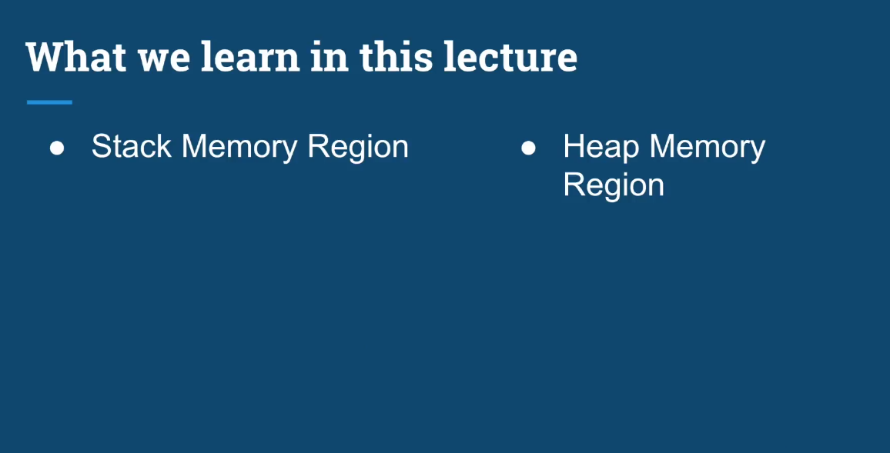

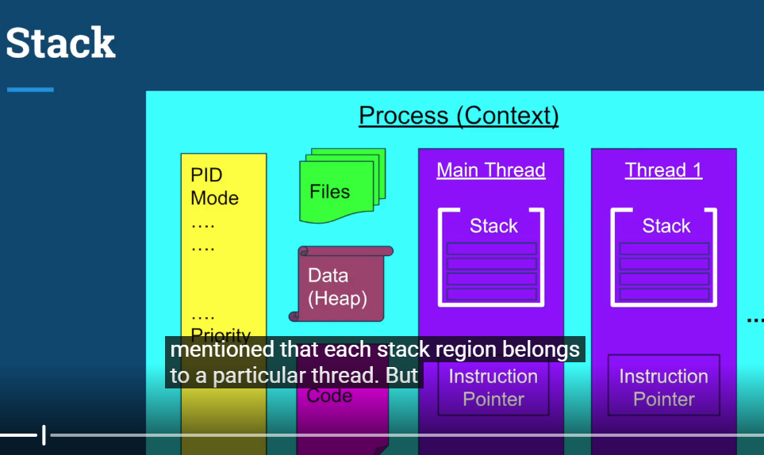
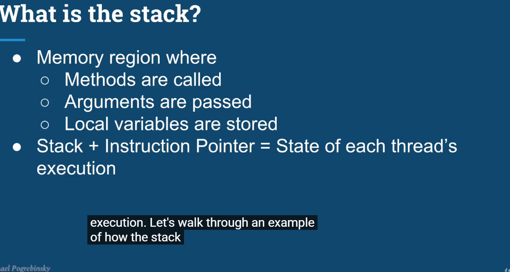
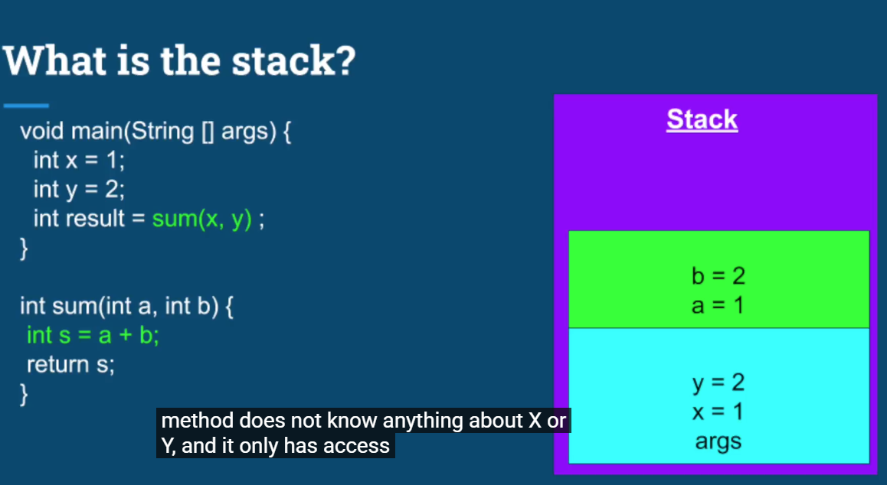
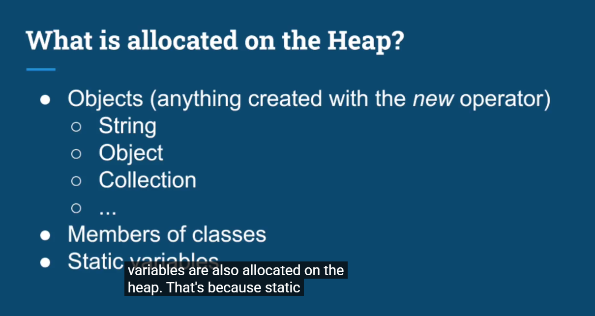
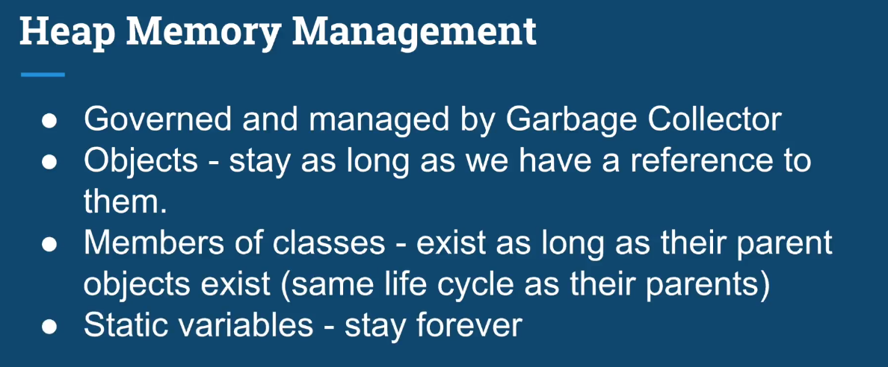
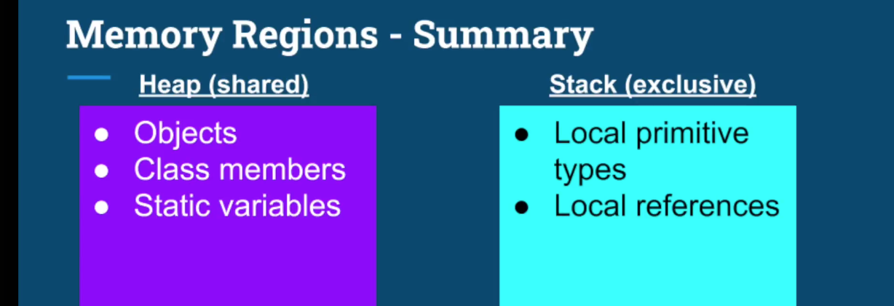


# Multithreading Memory & Resource Sharing Notes

## 1. Stack vs Heap

Each thread has its own **Stack**, while threads inside the same process share the **Heap**.

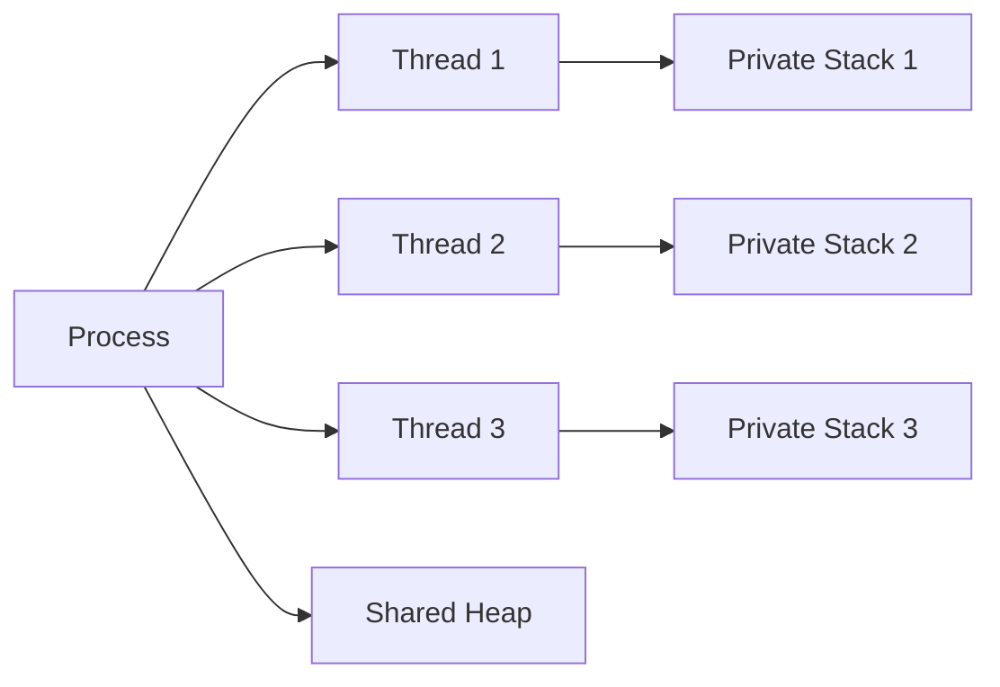

### Stack

The stack is private to each thread.

It stores things such as:

- Local primitive variables
- Local references
- Method-call information
- Method arguments
- Execution state

Example:

```java
void main() {
    int x = 1;
    int y = 2;

    int result = sum(x, y);
}

int sum(int a, int b) {
    int s = a + b;
    return s;
}
```

Conceptually:

```text
main() stack frame
------------------
x = 1
y = 2
result
args

sum() stack frame
-----------------
a = 1
b = 2
s = 3
```

Each method call creates its own stack frame.

### Important Stack Properties

- Each thread has its own stack.
- A thread cannot directly access another thread's stack.
- Stack memory is relatively small.
- Deep method calls or recursion can cause `StackOverflowError`.

---

## 2. Heap

The Heap is shared by threads in the same process.

Objects are stored on the heap.

Examples:

- Objects
- Arrays
- Collections
- Instance fields
- Shared application data

Example:

```java
Counter counter = new Counter();
```

Conceptually:

```text
Thread Stack                 Heap
------------                 -----------------
counter reference ---------> Counter object
                              count = 0
```

## 3. References vs Objects

A **reference is not the same thing as an object**.

```java
Counter counter = new Counter();
```

- `counter` is a reference.
- `new Counter()` creates the object.

Different threads may have different references pointing to the same object.

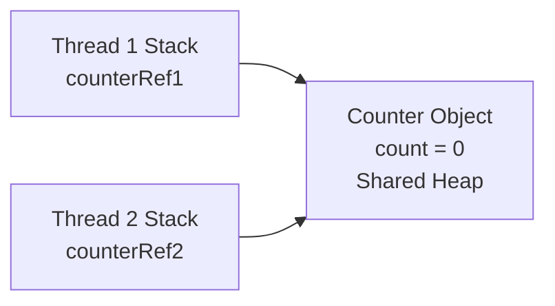

Therefore, the object becomes shared data.

> Stack = private to each thread  
> Heap = shared between threads

---

# Resource Sharing Between Threads

## 4. What is a Resource?

A resource can be anything multiple threads need to access.

Examples:

- Variables
- Objects
- Data structures
- Files
- Database connections
- Network connections
- Work queues
- Message queues

Resource sharing is useful because threads often need to cooperate.

---

## 5. Why Share Resources?

### Example 1: Text Editor

A UI thread edits the document while another thread saves it.

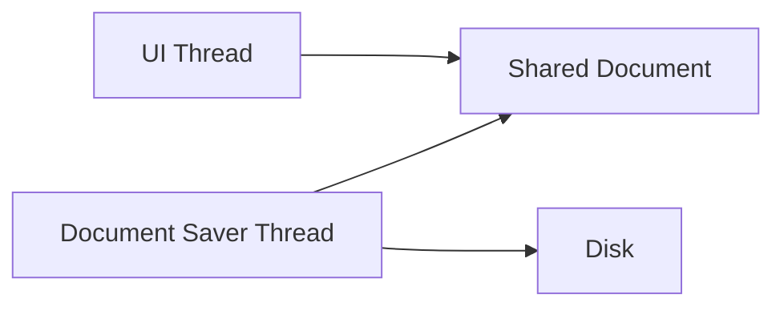

Both threads need access to the same document.

---

### Example 2: Work Queue

This is a common multithreading design.

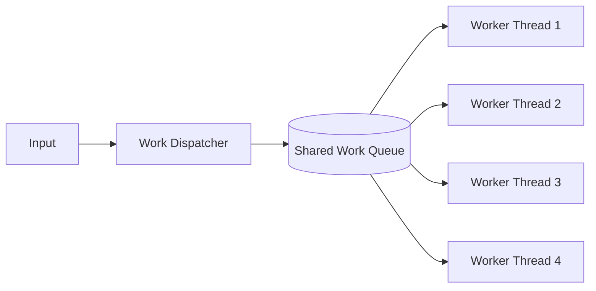

A fixed number of worker threads can consume tasks from the same queue.

This is usually better than creating one thread for every task.

Example:

```text
100 CVs
   ↓
Shared Queue
   ↓
Thread Pool
 ├── Worker 1
 ├── Worker 2
 ├── Worker 3
 └── Worker 4
```

---

### Example 3: Database Service

Multiple request threads may access the same database.

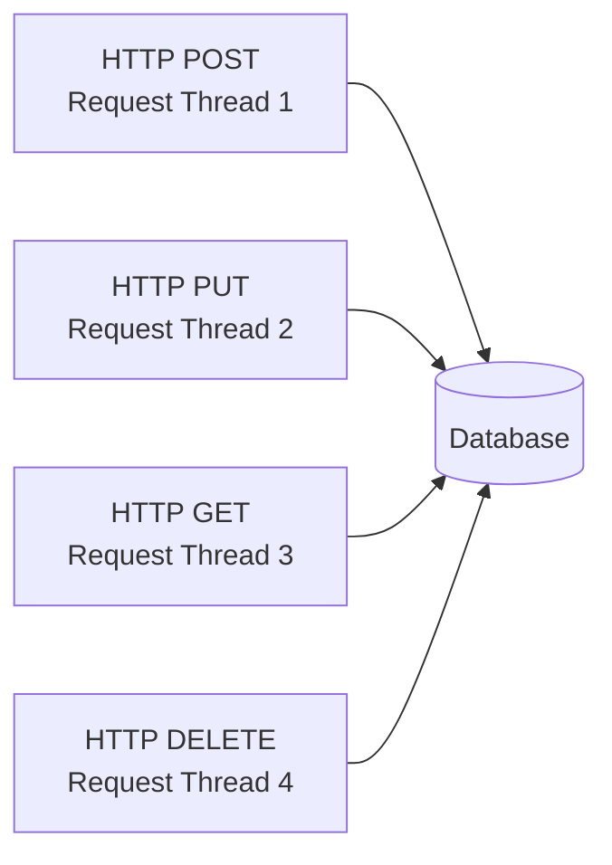

---

# The Main Problem: Shared Mutable Data

Sharing itself is not necessarily dangerous.

The problem is usually:

```text
Multiple Threads
        +
Shared Resource
        +
Resource Can Change
        ↓
Potential Concurrency Problem
```

This is called **shared mutable state**.

Example:

```java
class InventoryCounter {
    private int items = 0;

    public void increment() {
        items++;
    }

    public void decrement() {
        items--;
    }
}
```

If one object is shared:

```java
InventoryCounter counter = new InventoryCounter();
```

and two threads call:

```java
counter.increment();
counter.decrement();
```

then both threads modify the same shared state.

---

# Atomic Operations

## 6. What is an Atomic Operation?

An operation is **atomic** if it appears to happen as one indivisible operation.

Conceptually:

```text
START
  ↓
[ ATOMIC OPERATION ]
  ↓
END
```

No other thread can observe or interfere with a partially completed state.

---

## 7. `items++` Is NOT Atomic

This code:

```java
items++;
```

looks like one operation, but logically it consists of:

```text
1. Read the current value
2. Increment the value
3. Write the new value back
```

Equivalent idea:

```java
int currentValue = items;
int newValue = currentValue + 1;
items = newValue;
```

So:

```text
items++

=

READ
  ↓
MODIFY
  ↓
WRITE
```

This is a **read-modify-write** sequence.

---

# Race Condition

## 8. How a Race Condition Happens

Initial value:

```text
items = 0
```

Two threads:

```text
IncrementingThread → items++
DecrementingThread → items--
```

Expected:

```text
0 + 1 - 1 = 0
```

But the instructions can interleave.

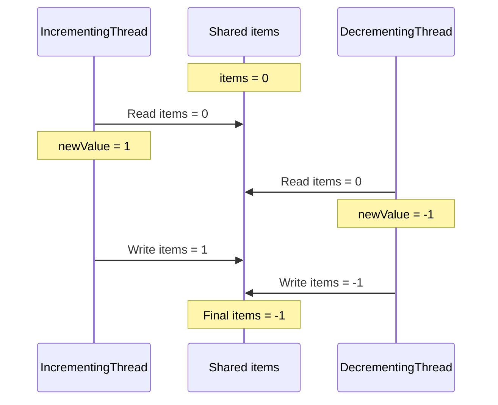

Final value can be wrong because both threads read the old value.

---

## 9. Context Switching and Race Conditions

One source-code line does **not** mean one atomic CPU/JVM operation.

For example:

```java
items++;
```

may be interrupted between its internal steps.

```text
Thread A
--------
READ
ADD

   <--- Context Switch --->

Thread B
--------
READ
SUBTRACT
WRITE

   <--- Context Switch --->

Thread A
--------
WRITE
```

Context switching itself is not a bug.

The problem is:

```text
Multiple threads
        +
Same mutable resource
        +
Non-atomic operations
        +
No synchronization
        ↓
Race Condition
```

---

# 10. Main Purpose of This Lecture

The lecturer is building this chain of ideas:

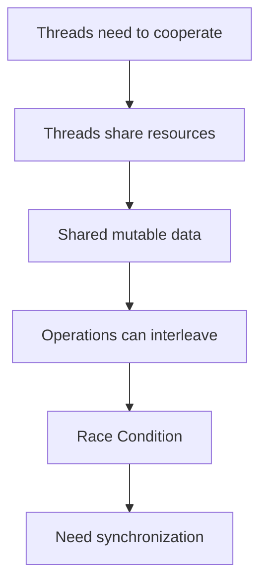

The goal is to understand **why synchronization is needed**.

Later solutions include:

- `synchronized`
- Locks
- `AtomicInteger`
- `BlockingQueue`
- Concurrent Collections

---

# 11. Key Takeaways

```text
Stack
→ private to each thread

Heap
→ shared by threads in the same process

References
→ may be local to a thread

Objects
→ can be shared through references

Shared mutable state
→ can cause concurrency problems

items++
→ NOT atomic

items++
→ READ + MODIFY + WRITE

Multiple threads + shared mutable data + no synchronization
→ possible Race Condition
```
# Section 2
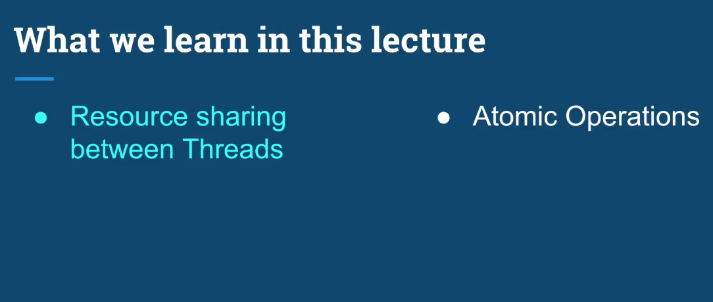
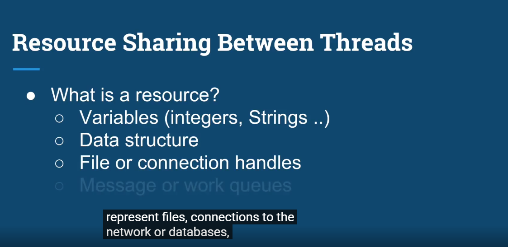
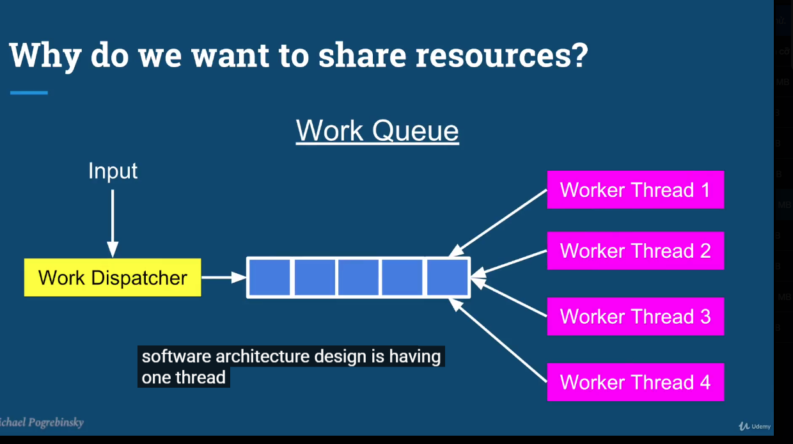
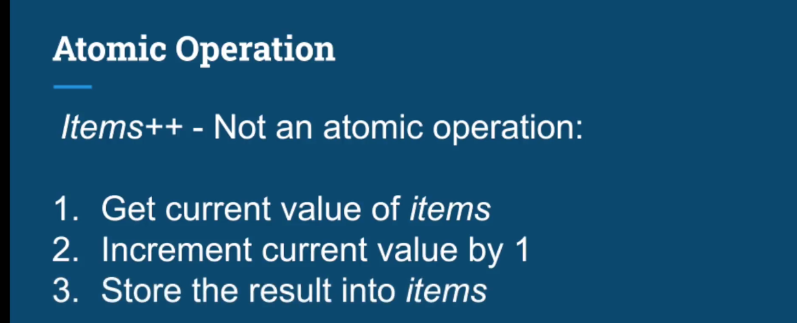
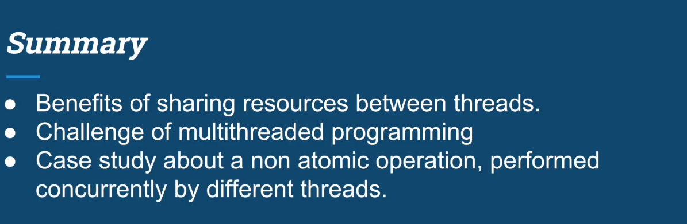

## One sentence to remember

> Sharing data is necessary for thread cooperation, but shared mutable data is one of the main sources of concurrency problems.
