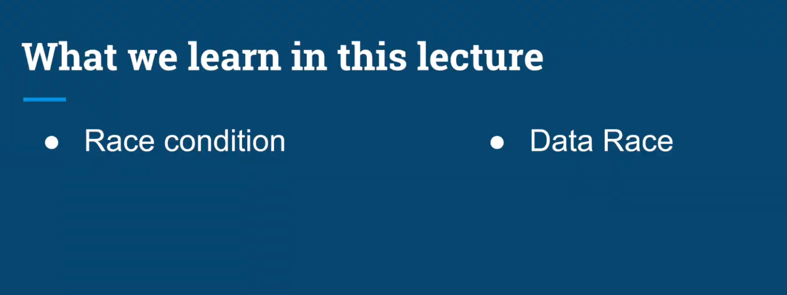
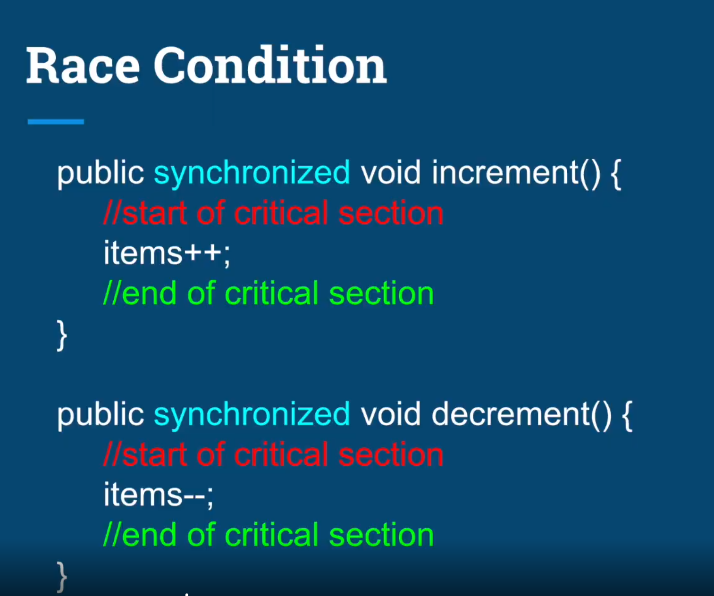
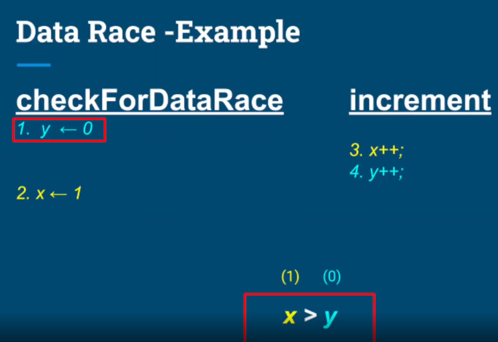
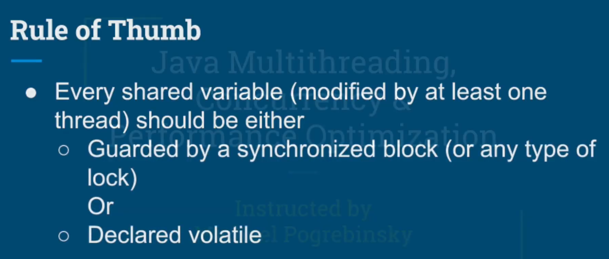

## Race condition

- Condition when multiple threads are accesing a shared resouce.
- At lease one is modifying the resource.
- The timing of threads' scheduling may cause incorrect result.
- The core of the problem  non-atomic operations performed on the shared resource.

## Data Race

### Problem
- Compiler and CPU may excecute the instructions out of order to optimize performance and utilization.
- They will do so while maintaining the logical correctness of the code.
- Out of order execution by the compiler and CPU are important features to speed up the code.

### Data Race - Solutions
Establish a Happens - Before semantics by one of these methods:
- Synchronization of methods which modify shared variables.
- Declaration of shared variables with the volatile keyword.
# Summary
- Two problems with multithreaded applications
  - Race Conđitión
  - Data races
- Both involve
  - Multiple threads
  - At least one is modifying a shared variable
- Both problems may result in unexxpected an incorrect result.
- Synchronized - Solve both race conđition adn datarace
- Volatile
  - Solve Race codition for read/write from/to long and double
  - Solves all data races by guaranteeing order.
