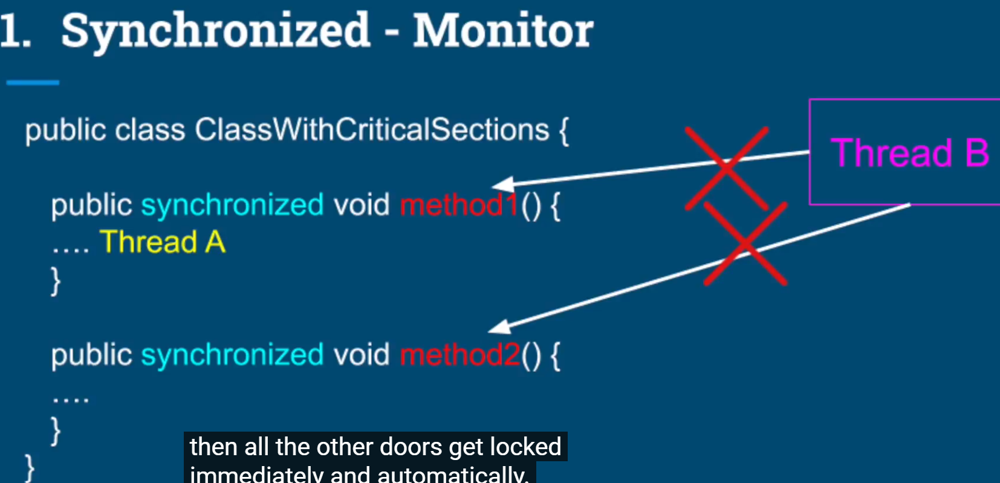
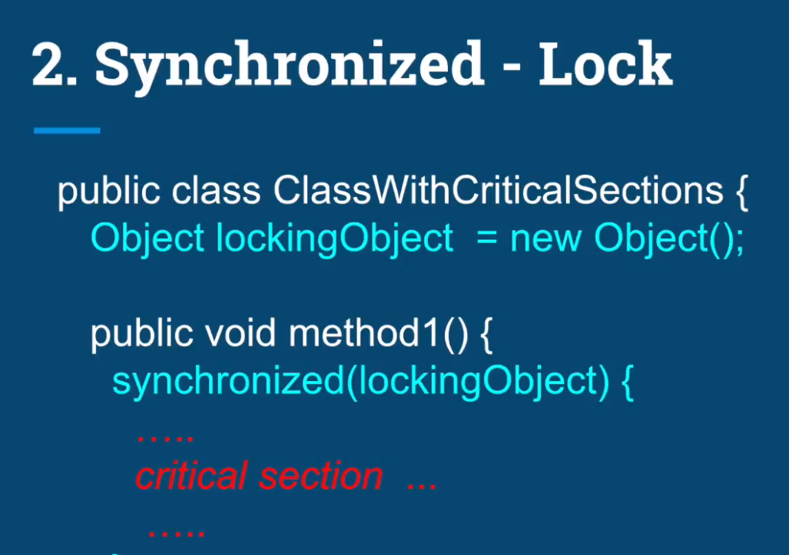
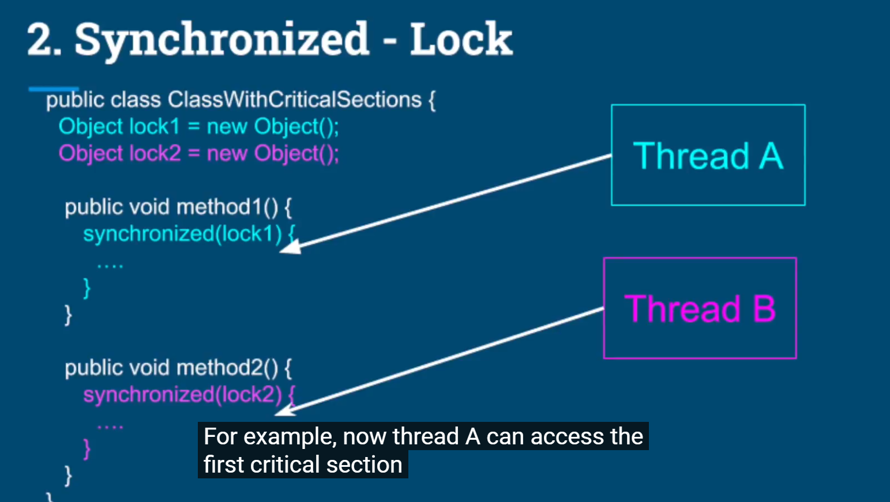
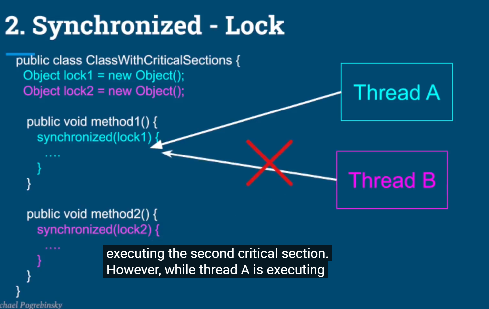
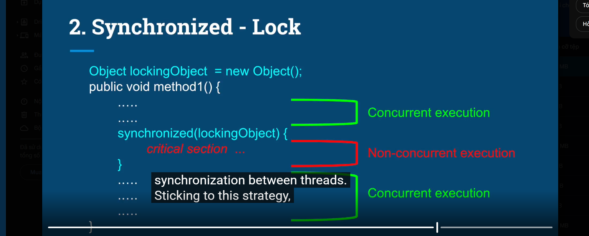

# The concurrency problem
- Two threads sharring the items counter.
- Both threads are reading and modifying that counter in the same time.
- The operations were not atomic

# New things
## Synchronized 
- Locking mechanism
- Used to restrict access to a critical section or entire method to a single thread at a time.\
- There are two ways to use synchronized:
    - Synchronized monitor method
      - Thread A get monitor lock on the object.
      - When a thread get a synchronized instance method, other synchronized instance method in same object will be blocked until the thread release the lock.
  
    - Synchronized block
      - Any synchronized block which is synchronired on the same object will
allow only one thread to execute inside that block at a time.
      - The synchronized block can be used to synchronize only a part of the method instead of the entire method.
  
      - Threads A 
        
        

    - Synchronized block is Reentrant
    - A thread cannot prevent itself from entering  a critical section.

# Summary 1
- Formal definition of concurrency problem
- we now can identify the code that we need to exectue atomically, by declaring that code as a critical section
- Use of synchronized keyword to protect the critical section in two ways.
  - Simple way (in front of a method)
  - On an explicit object - More flexible and granular, but also more verbose.

# Summary 2
- Atomic operations
    - Assignments to primitive types (excluding double and long).
    - Assignments to references.
    - Assignments to double and long using volatile keyword.
- Metrics capturing Use case.
- Knowledge about atomic operations is key to high performance.