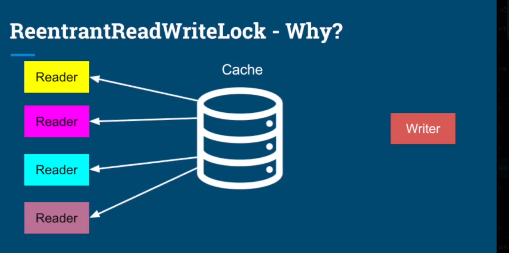
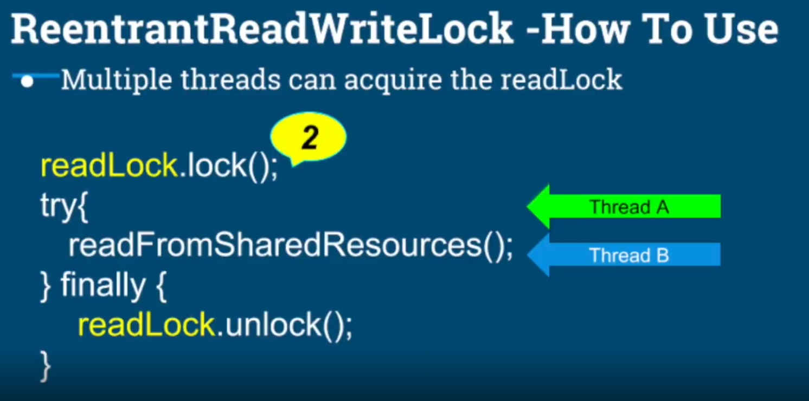
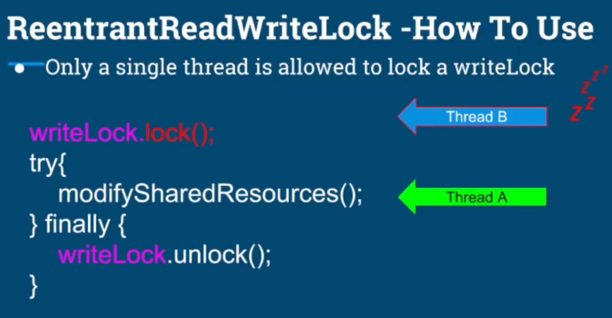
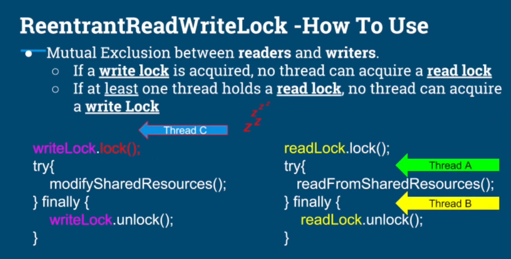
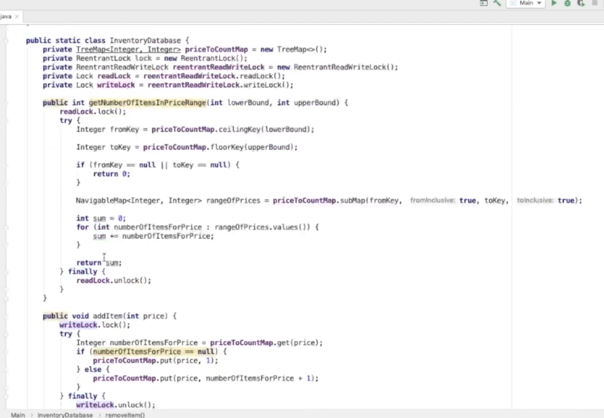

# What we learn in this lecture
- ReentrantReadWriteLock (Read Lock and Write lock).
- Practical Use case.
# ReentrantReadWriteLock - WHy ?
- Race Conditions require
  - Multiple threads sharing a resource.
  - At least one thread modifying the resource.
- Solution - Complete mutual exclusion
  - Regardless of operation (read/write/both)
  - Lock and allow only one  thread to critical section.


# ReentrantReadWriteLock - When to use
- When read operations are predominant.
- Or when the read operations are not as fast.
  - Read from many variables
  - Read from a complex data structure.
- Mutual exclusion of reading threads negatively impacts the performance.

# ReentrantReadWriteLock - How to use
```code
ReentrantReadWriteLock rwLock = new ReentrantReadWriteLock();
Lock readLock = rwLock.readLock();
Lock writeLock = rwLock.writeLock();

writeLock.lock();
try {
modifySahredResources();
} finally {
writeLock.unlock();
}

readLock.lock();
try {
readFromSharedResources();
} finally {
readLock.unlock();
}
```




# ReentrantReadWriteLock - Inventory Database Implementation



# SUMMARY 
- Using regular binary locks with read intensive workloads, prevents concurrent read from shared resource.
- ReentrantReadWriteLock
  - ReadLock
  - WriteLock
  - Allows multiple readers, read shared resource concurrently.
- Read Intensive usecase where we increased the performance and finished 3x faster.

# Key-takeaway
- ReentrantReadWriteLock is not always better than a conventional lock.
- Use the right tool for the job
- Measure and validate assumptions.