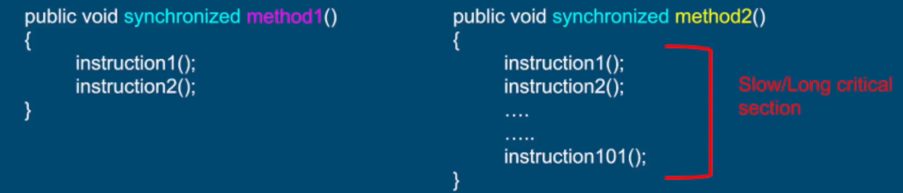

# What we learn in this lecture
- Problems and limitations of locks.
- Introduction to lock free programming.
- Review of Atomic instruction.
- Introduction to a new group of atomic operations.

# Why learning lock free techniques?
- As engineers we are always faced with a trade off
- For most problems there's more than one solution.
- The more tools with have the better we can choose the right tool for the job.
- Being able to choose the right tool for the job is what makes a good engineer.

# Deadlocks
- Deadlocks are generally unrecoverable.
- Can bring the application to a complete halt.
- The more locks in the application, the higher the chance for a deadlock.
- 
# Slow critical section
- Multiple threads using the same lock.
- One thread holds the lock for vey long.
- That thread will slow down all the other threads.
- All threads become as slow as the slowest thread.

# Thread Not releasing a lock (Kill tolerance)
- thread dies, gét interrupted or forrgets  to release the lock.
- Leaves all thread hanging forever.
- Unrecoverable, just like a deadlock.
- To avoid, developers need to write more complex code.

# Performance 
- Performance overhead in having contention over a lock.
  - Thread A acquires a lock
  - Thread B tries to acquire a lock and gets blocked.
  - Thread B is scheduled out (context switch).
  - Thread B is scheduled back (context switch).
- Additional overhead may not be noticable for most applications.
- But for latency sensitive applications, this overhead can be significant.

# Lock free techniques
- Why did we need locks?
  - Multiple threads accessing shared resources.
  - At least one thread is modifying the shared resources.
  - Non atomic operations.

# Non-atomic operations - Reason
- Non atomic operation on one shared resource.
- A single java operation turns into one or more hardware operations.
- Example: counter++ turns into 3 hardware instructions:
  - Read count.
  - Calculate new value.
  - Store new value to count.

# Review of all atomic instruction we learned
- Read/ Assignment on all primitive types (except long and double).
- Read/ Assignment on all references.
- Read/ Assignment on volatile long and double.

# AtomicX classes
- Class located in the *java.util.concurrent.atomic package*.
- Internally uses the Unsafe class which provides access to low level, native methods.
- Utilize platform specific implementation of atomic operations.