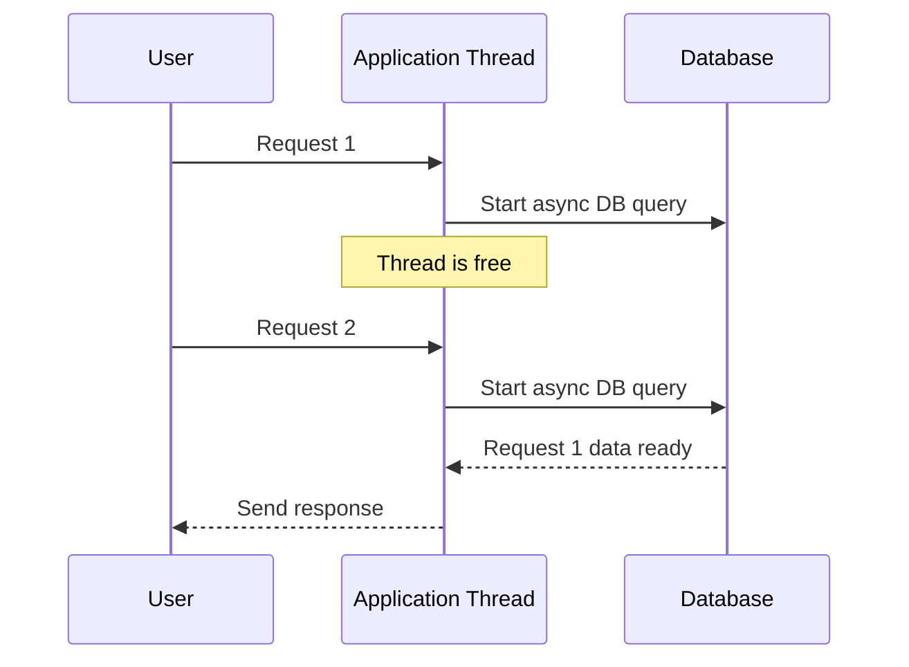
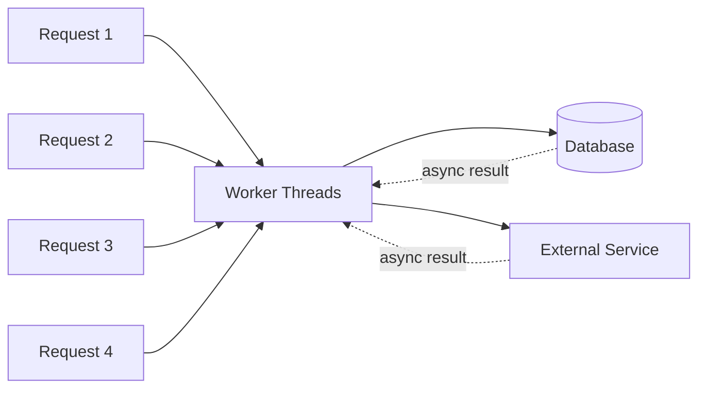
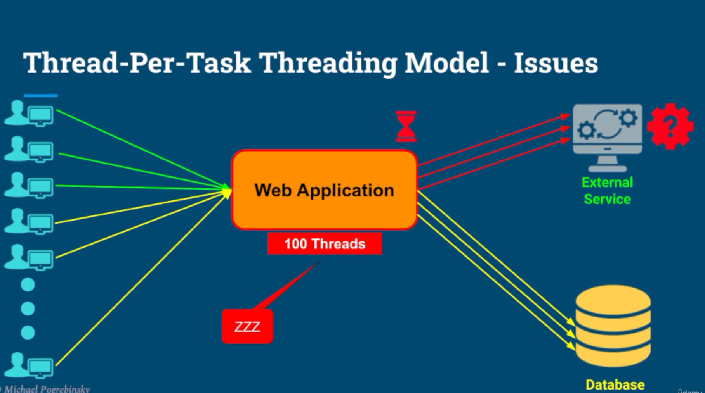
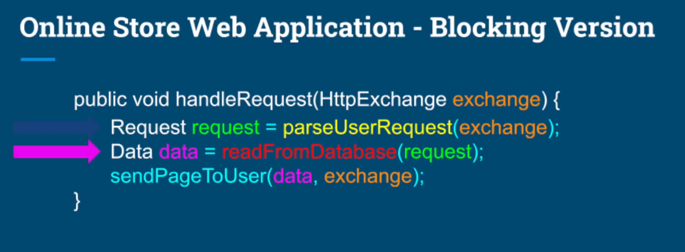
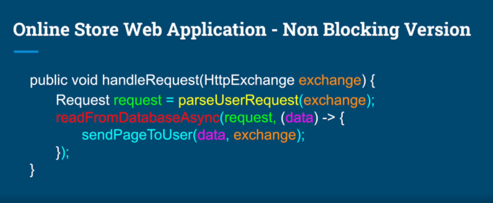
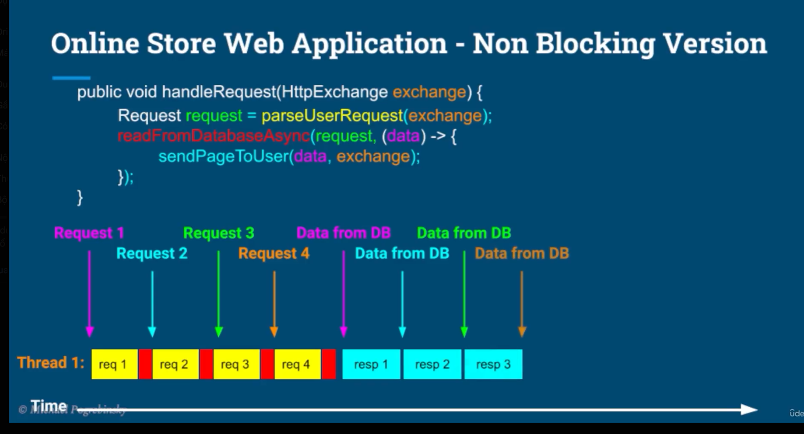
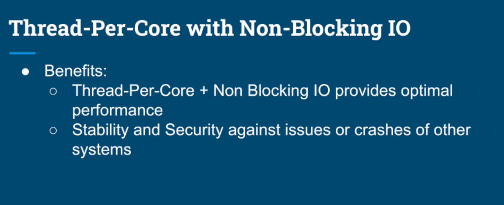
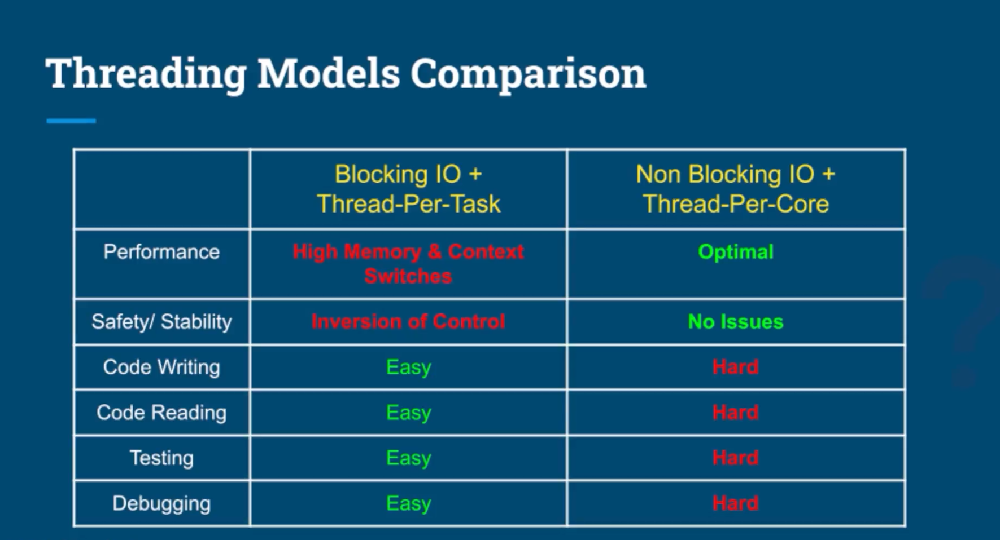
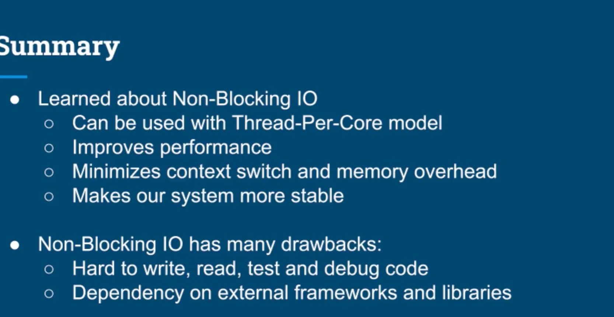

# Asynchronous Non-Blocking I/O with Thread-Per-Core

## 1. Core Idea

In a **blocking I/O** model, a thread waits while an external operation is running:

- Database query
- HTTP/API call
- File/network I/O

While waiting, that thread cannot do useful work.

With **non-blocking / asynchronous I/O**, the thread starts the I/O operation and continues processing other requests.  
When the I/O result is ready, a callback/event resumes the remaining work.

---

## 2. Example Flow

```java
public void handleRequest(HttpExchange exchange) {
    Request request = parseUserRequest(exchange);

    readFromDatabaseAsync(request, data -> {
        sendPageToUser(data, exchange);
    });
}
```

The important point:

```text
Thread does NOT wait for the database.
```

Instead:



One thread can therefore make progress on many requests while I/O operations are running.

---

## 3. Thread-Per-Core Model

With non-blocking I/O, we do not need one thread for every request.

A common model is:

```text
Number of worker threads ≈ Number of CPU cores
```

Example:

```text
8 CPU cores
   ↓
~8 worker threads
   ↓
Thousands of concurrent I/O operations can still be in progress
```



The threads remain busy mainly with **CPU work**, instead of sitting idle waiting for I/O.

---

## 4. Why Thread-Per-Core Works Here

For CPU-bound work, having significantly more runnable threads than cores causes unnecessary:

- Context switching
- Memory usage
- Scheduling overhead

With non-blocking I/O, threads are not blocked during long I/O waits.

Therefore:

```text
few threads + async I/O
        ↓
better CPU utilization
        ↓
fewer context switches
        ↓
lower memory overhead
```

---

## 5. Blocking vs Non-Blocking

| | Blocking I/O + Thread-Per-Task | Non-Blocking I/O + Thread-Per-Core |
|---|---|---|
| Threads | Often many | Usually near CPU-core count |
| I/O waiting | Thread blocks | Thread is released |
| Memory usage | Higher | Lower |
| Context switches | More | Fewer |
| Performance at high concurrency | Can degrade | Often better |
| Code writing | Easier | Harder |
| Code reading | Easier | Harder |
| Testing | Easier | Harder |
| Debugging | Easier | Harder |

---

## 6. Main Benefits

### Performance

Non-blocking I/O can handle many concurrent requests without creating a large number of threads.

### Stability

If an external service or database becomes slow, application threads are not all stuck waiting on it.

This reduces the risk of **thread-pool exhaustion**.

### Resource Efficiency

Instead of:

```text
1000 requests → ~1000 blocked threads
```

we may have:

```text
1000 requests
    ↓
8 worker threads
    +
1000 asynchronous I/O operations
```

---

## 7. Main Trade-Off

Non-blocking code is usually harder to:

- Write
- Read
- Test
- Debug

because execution is no longer strictly sequential.

For example:

```text
request
  ↓
start async operation
  ↓
method returns
  ↓
other work happens
  ↓
I/O result arrives later
  ↓
callback continues processing
```

So the control flow is spread across callbacks, events, futures, or reactive pipelines.

---

## 8. Key Takeaway

```text
Blocking I/O
→ thread waits
→ need more threads for concurrency
→ more memory + context switching

Non-Blocking I/O
→ thread does not wait
→ small number of threads can handle many requests
→ Thread-Per-Core becomes practical
```

### Rule of Thumb

```text
CPU-bound:
    threads ≈ CPU cores

Blocking I/O:
    often need more threads than cores

Non-blocking I/O:
    threads ≈ CPU cores can work very well
```

> **Non-blocking I/O does not make the database or network faster.**  
> It makes the application use its threads more efficiently while waiting for them.
8. Thread per task model

- Does not give us optimal performance:
  - When a thread is blocking on IO, it cannot be used.
  - Required us to allocate more threads.
  - Consuming more resource.
  - Add context switching overhead.
- Stability issues due to Inversion of Control(IoC).






