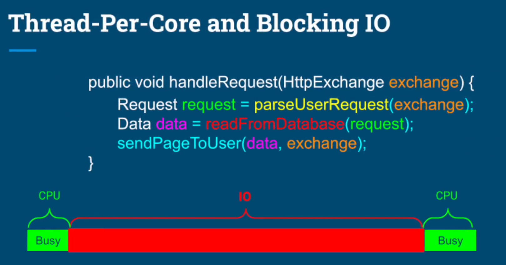
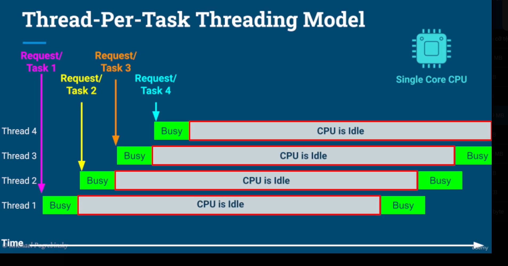
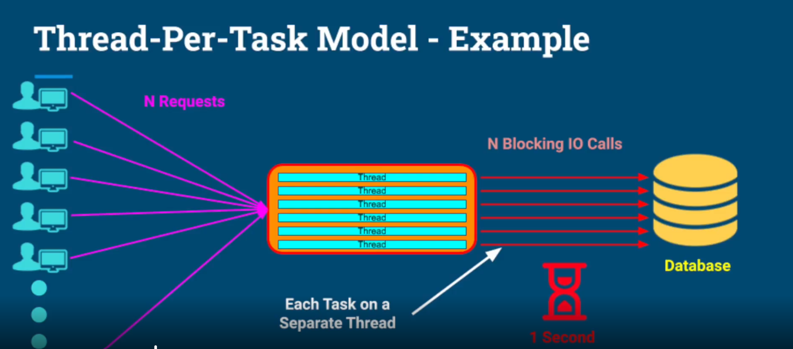
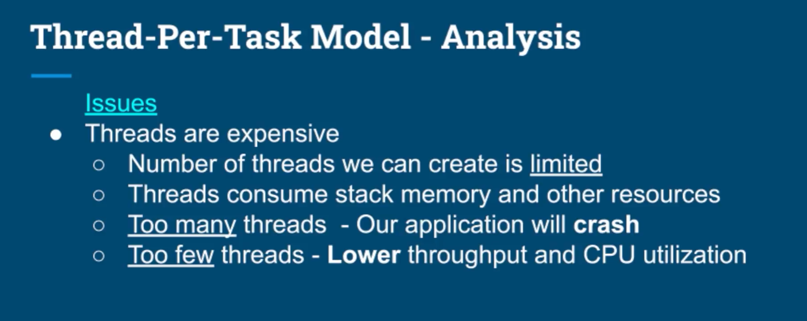
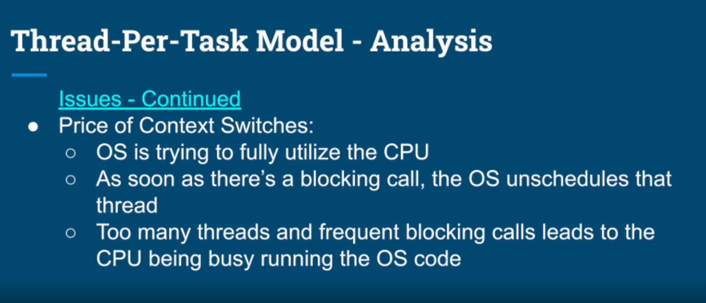
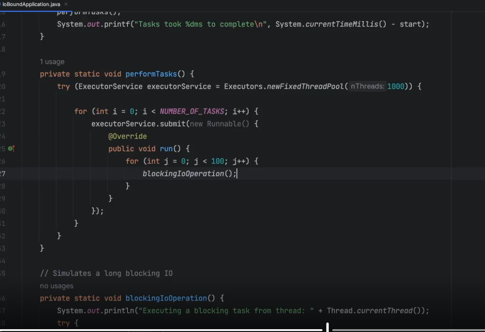
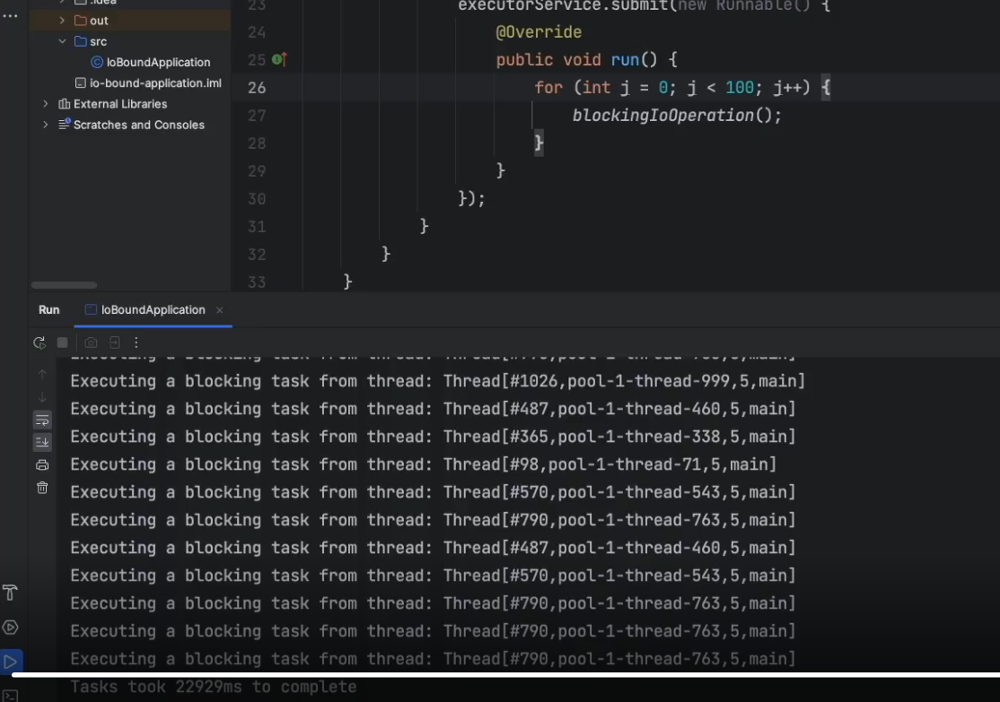
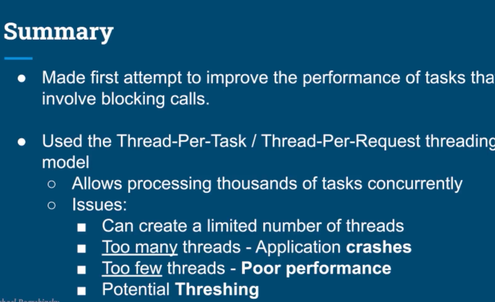

What we learn in this lecture?
- Introduction to Thread-Per-Task Threading Model
- Practical Example of an IO-bound Application.
- Performance Analysis And Conclusion.

# Benefits
- Improvement for:
  - Throughput.
  - Hardware Utilization.
- Processed tasks concurrently and completed them faster than in the thread-per-core model.

- Threading: a situation where most of the CPU is spent on the OS managing the system.
