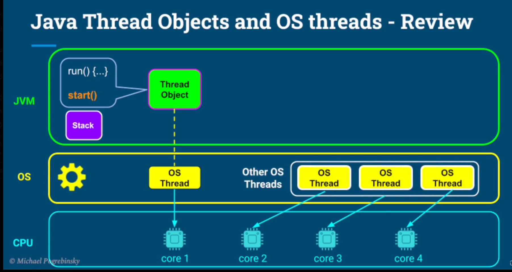
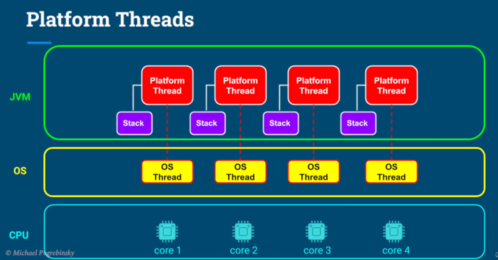
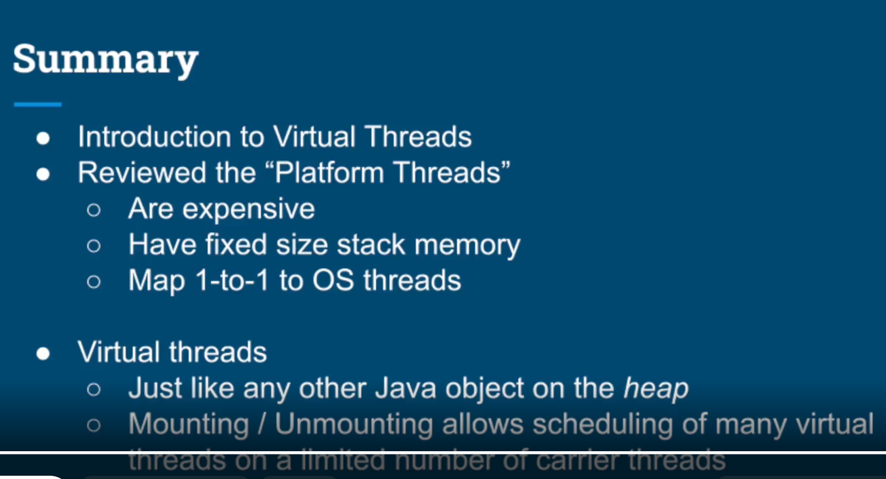

# What we learn in this lecture

- Quick review of Java Thread and OS threads.
- Introduction to Virtual Threads.
- Demo of Virtual Threads.

## Quick review of Java Thread and OS threads

## Virtual threads
- Newer type of thread, introduced in JDK 21.

# Summary

 