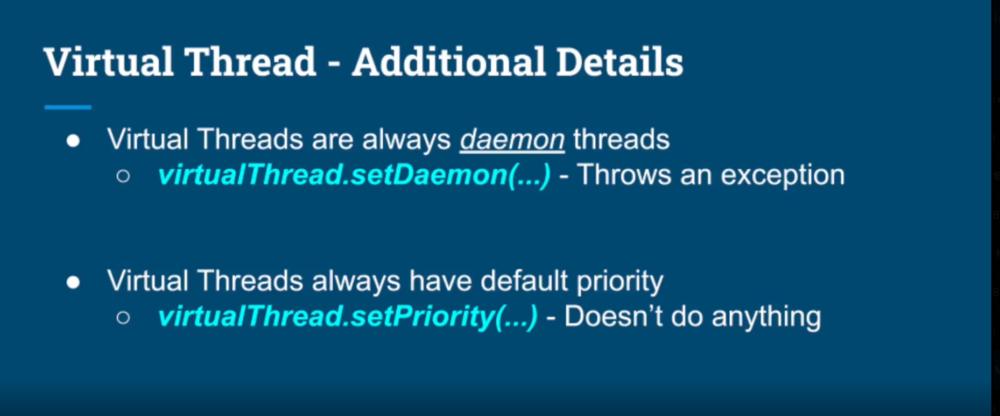
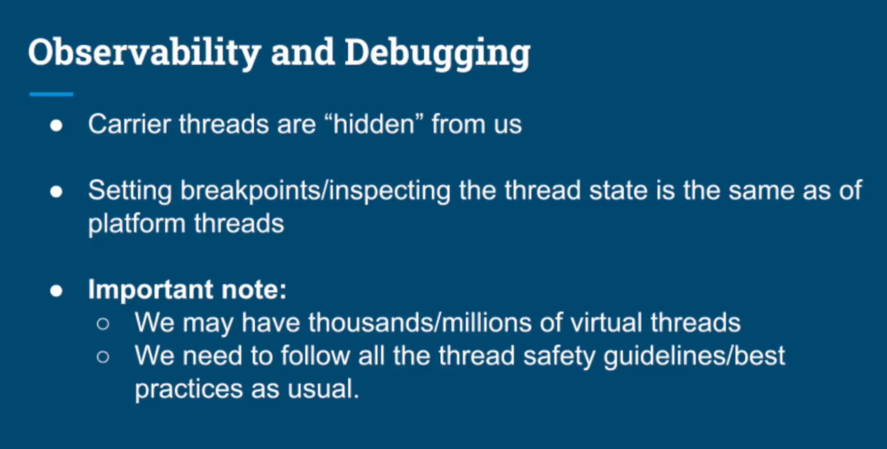
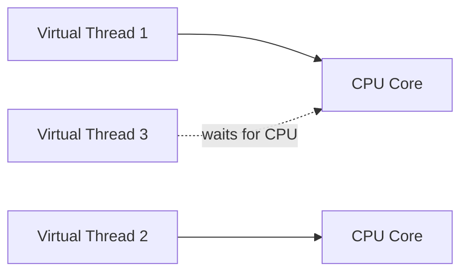
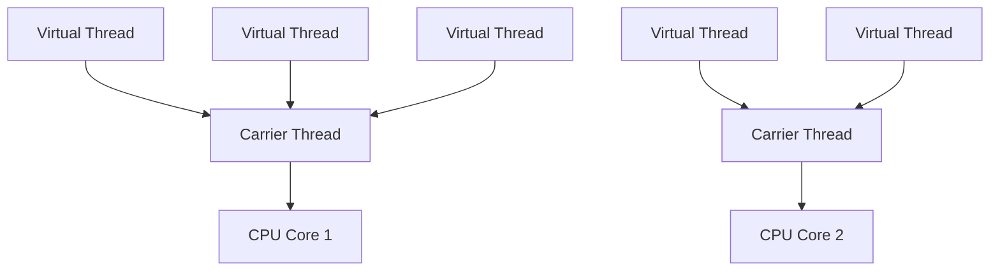
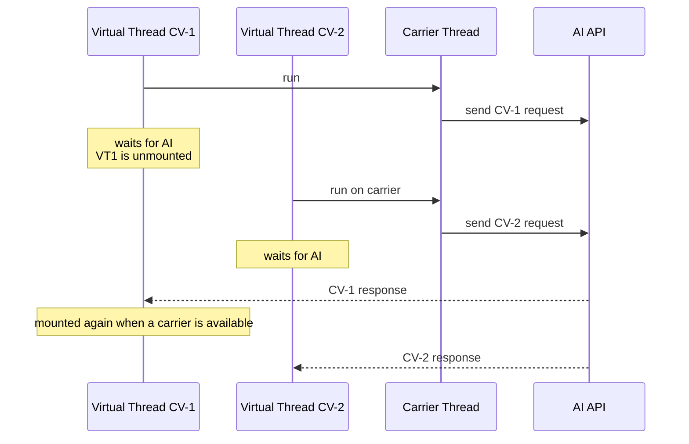

# Virtual Threads — Best Practices

> Summary of the **Virtual Threads Best Practices** lesson.


## 1. Virtual Threads do not make CPU-bound tasks faster

If a task mainly performs CPU computation:

```text
CPU work -> CPU work -> CPU work
```

Virtual Threads usually provide **little or no benefit**.

Why?

- The number of CPU cores does not increase.
- Virtual Threads do not add more CPU processing power.
- They are mainly useful when tasks spend time **waiting for I/O**.



**Rule of thumb:**

- CPU-bound → keep concurrency close to the number of CPU cores.
- I/O-bound / blocking I/O → Virtual Threads are a good fit.

---

## 2. Virtual Threads do not reduce latency

Virtual Threads mainly improve **throughput**, not the execution time of one individual request.

Example:

```text
CPU -> wait for I/O -> CPU
```

If one request normally takes `T` seconds, using Virtual Threads does not automatically make `T` smaller.

The benefit is that while one Virtual Thread is waiting for I/O, the carrier thread can run another Virtual Thread.

```text
Platform Thread:
Task A ---- waiting for I/O -------------------- finish
           platform thread is occupied

Virtual Thread:
Task A ---- waiting for I/O -------------------- finish
              |
              +--> unmounted
                   carrier runs Task B
```

So:

```text
Virtual Threads -> more concurrent tasks
                -> higher throughput
                != lower latency per request
```

---

## 3. Avoid too many very short blocking operations

A large number of very short blocking operations may be less efficient.

Example:

```text
block 5ms
run
block 5ms
run
block 5ms
run
...
```

Each block/unblock may involve:

```text
Virtual Thread
   ↓ block
unmount from carrier
   ↓
I/O completes
   ↓
mount again on a carrier
```

Virtual Threads are still lightweight, but repeated mounting and unmounting has some overhead.

### Better approach

If possible, batch many small I/O operations into fewer larger operations.

```text
Less efficient:
IO -> IO -> IO -> IO -> IO

Better:
       one larger I/O operation
──────────── IO ────────────
```

---

## 4. Do not use fixed-size pools for Virtual Threads

Avoid treating Virtual Threads like a traditional fixed-size thread pool.

For example, do not use:

```java
Executors.newFixedThreadPool(...);
```

just to limit the number of Virtual Threads.

The main Virtual Thread model is:

> **One virtual thread per task**

Example:

```java
try (var executor = Executors.newVirtualThreadPerTaskExecutor()) {
    executor.submit(task1);
    executor.submit(task2);
    executor.submit(task3);
}
```

Virtual Threads are lightweight, and the JVM multiplexes many of them over a much smaller number of carrier threads.



### How should resource limits be handled?

Do not limit the number of Virtual Threads directly.

Instead, limit the **scarce resource** itself.

Examples:

- database connections
- concurrent AI API requests
- API rate limits
- HTTP connections
- access to an external service

Example:

```java
Semaphore semaphore = new Semaphore(10);

executor.submit(() -> {
    semaphore.acquire();
    try {
        callExternalApi();
    } finally {
        semaphore.release();
    }
});
```

---

## 5. Thread safety is still important

A Virtual Thread is still a **Thread**.

All normal concurrency problems still exist:

- Race Condition
- Data Race
- Deadlock
- Shared Mutable State
- Inter-thread Communication
- Locking
- Lock-free algorithms

This code can still be unsafe:

```java
int count = 0;

count++;
```

if multiple Virtual Threads update `count` without proper synchronization.

```text
Virtual Thread != automatically thread-safe
```

---

## 6. Virtual Threads are always daemon threads

Virtual Threads are always daemon threads.

You cannot make them non-daemon.

Example:

```java
Thread vt = Thread.ofVirtual().start(() -> {
    // work
});

vt.setDaemon(false); // not allowed
```

This means the JVM does not stay alive only because Virtual Threads are still running.

Application lifecycle still has to be managed correctly.

---

## 7. Virtual Thread priority

Virtual Threads do not rely on thread priority in the same way as Platform Threads.

Code like:

```java
virtualThread.setPriority(...);
```

should not be used as a scheduling strategy.

Do not design your application around Virtual Thread priority.

---

## 8. Debugging and observability

Carrier Threads are mostly managed by the JVM and are largely hidden from application code.

Virtual Threads can still be debugged with:

- breakpoints
- stack traces
- thread inspection
- normal debugging tools

However, an application may have:

```text
thousands
or even millions
of Virtual Threads
```

So logs should identify business operations using IDs such as:

```text
jobId
batchId
candidateId
requestId
```

instead of depending mainly on the thread name.

---

# Quick Cheat Sheet

| Scenario | Virtual Thread |
|---|---|
| CPU-bound task | ❌ Little benefit |
| Long blocking I/O | ✅ Very suitable |
| HTTP / AI API call waiting for response | ✅ Suitable |
| Blocking database call | ✅ Suitable |
| Reduce one request's latency | ❌ Not the main purpose |
| Increase I/O-bound throughput | ✅ |
| Fixed-size Virtual Thread pool | ❌ Avoid |
| Thread-per-task | ✅ Recommended |
| Race conditions / deadlocks | ⚠️ Still possible |
| Thread priority | ❌ Do not rely on it |
| Daemon thread | ✅ Always daemon |

---

# Applying This to CV Processing

A CV processing flow may look like this:

```text
CV
 ↓
Prepare Context
 ↓
Call AI API
 ↓
Wait for AI Response
 ↓
Process Response
```

The following part:

```text
Call AI API -> wait for response
```

is usually **blocking I/O**.

This is a strong use case for Virtual Threads.

While one CV is waiting for the AI response:

```text
Virtual Thread A
    ↓
call AI
    ↓
BLOCKED
    ↓
unmounted from carrier thread
```

the carrier thread can execute another CV task.



This allows the application to handle many CVs concurrently without requiring one Platform Thread for every waiting request.

However, you should still limit the number of concurrent AI calls if the provider has rate limits.

```text
Virtual Threads
      ↓
Semaphore / Rate Limiter
      ↓
AI API
```

---

# Key Takeaways

```text
Virtual Threads do not make the CPU faster.
Virtual Threads do not directly reduce latency.

Virtual Threads make blocking much cheaper,
especially when many I/O-bound tasks run concurrently.

Use:
    one virtual thread per task

Avoid:
    fixed-size virtual-thread pools

Remember:
    Virtual Thread is still a Thread

So these problems still exist:
    race conditions
    deadlocks
    data races
```
