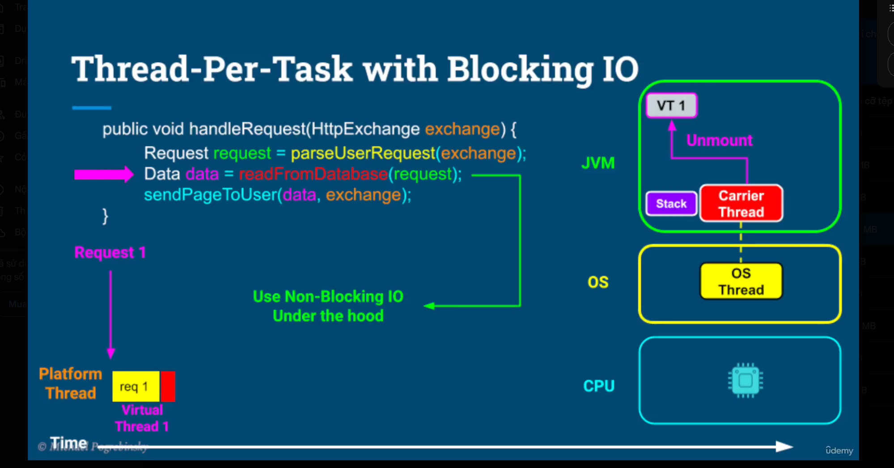
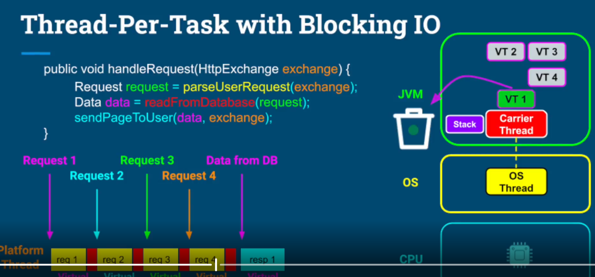
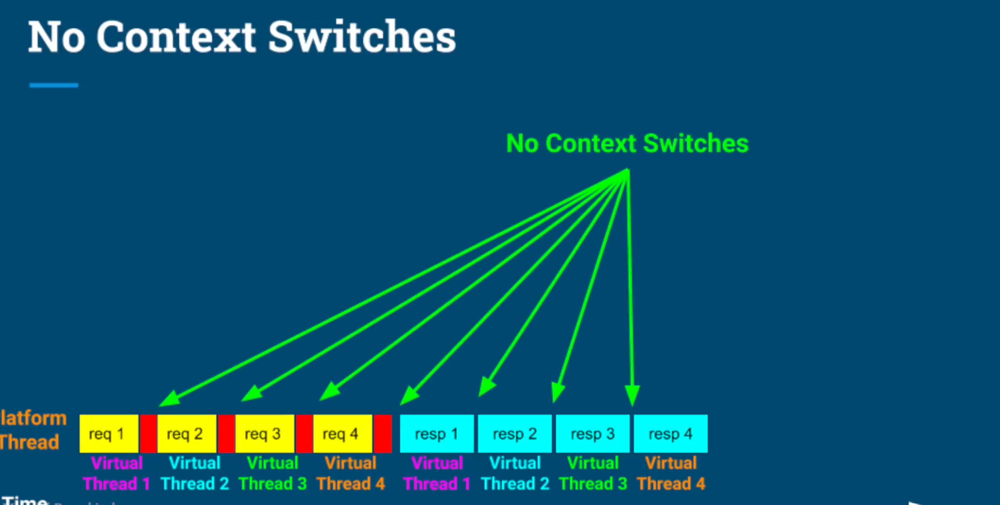
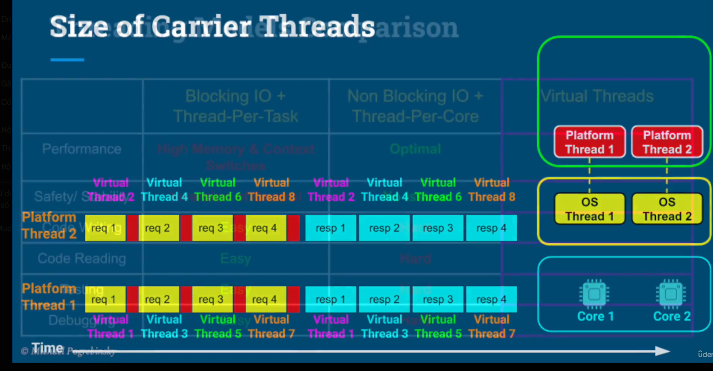
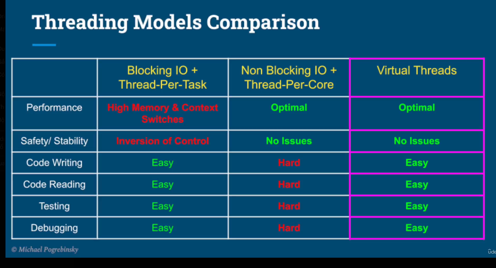
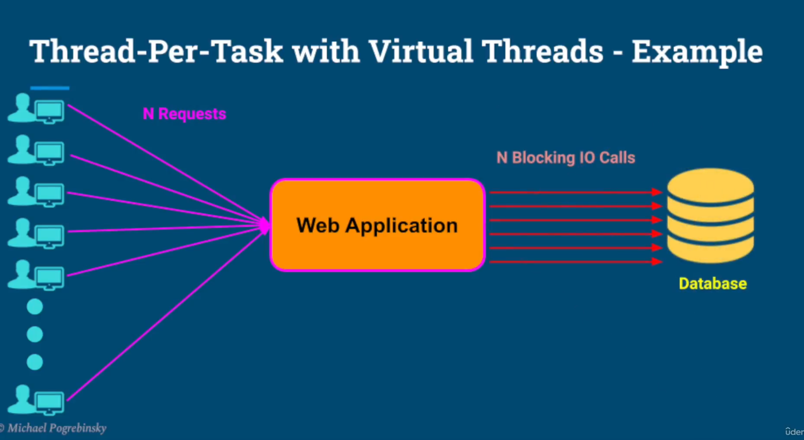
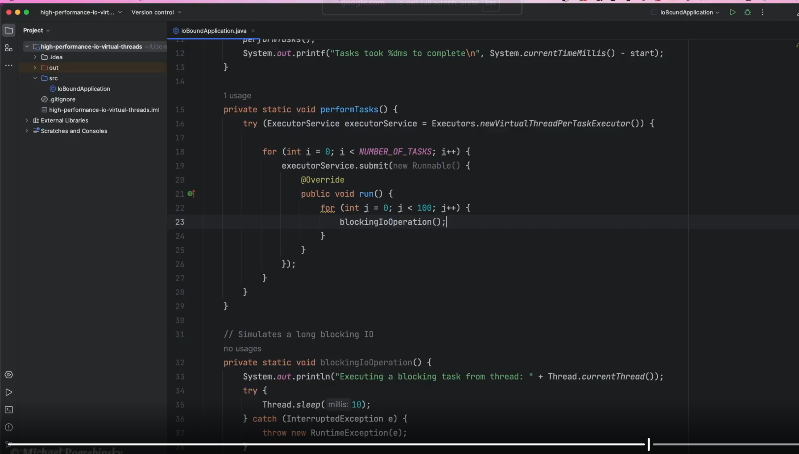

# Watch practice 

# Summary
- Performance benefits of virtual threads for long blocking call.
- Virtual threads are a perfect choice for IO bound applications.
- using virtual threads:
  - We get similar performance as thread-per-core + Non-blocking IO.
  - We get the easse of programming, testing and debugging pff thread-perr-task+blockAPI
- Virtual threads' mounting + unmounting
  - Has a bit of overhead
  - Not s much as a context switch.